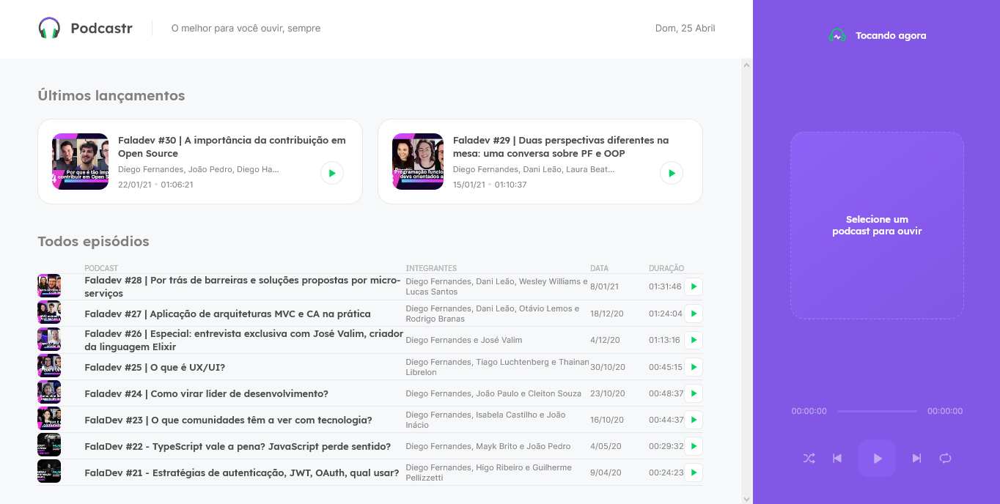

# Posdcastr
Projetinho em NextJs com ReactJS e typescript feito na next level week 5

# Como rodar
<ul>    
    <h2>Modo de desenvolvimento</h2>
    <li>Instale todas dependências com npm install</li>
    <li>Rode o json server com npm run server</li>
    <li>Rode o front-end em modo de desenvolvimento com npm run dev</li>
    <h2>Modo de Produção</h2>
    
Algumas funcionalidades só funcionam em modo de produção como o SSG do next

    <li>Rode o script de construção da apicação npm build</li>
    <li>Rode o front-end em modo de produção com npm run start</li>
</ul>

# Tecnoligias Usadas

Tecnologia | Documentação
-----------|-------------
NextJS | <a href="https://nextjs.org/docs/getting-started">https://nextjs.org/docs/getting-started</a>
ReactJS | <a href=":https://pt-br.reactjs.org/docs/getting-started.html">https://pt-br.reactjs.org/docs/getting-started.html</a>
JsonServer | <a href="https://www.npmjs.com/package/json-server">https://www.npmjs.com/package/json-server</a>
TypeScript | <a href="https://www.typescriptlang.org/docs/">https://www.typescriptlang.org/docs/</a>
SASS | <a href="https://sass-lang.com/documentation">https://sass-lang.com/documentation</a>

# Paginas Da Aplicação

<h2>Home</h2>

Página principal da aplicação que lista todos os episódios do podcastr

<h2>Episode<h2>

    Página de detalhes de um episódio clicado na página home

